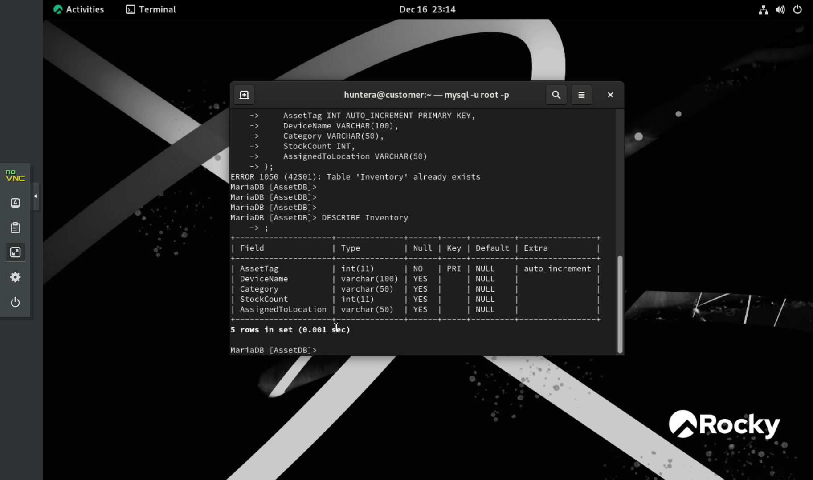
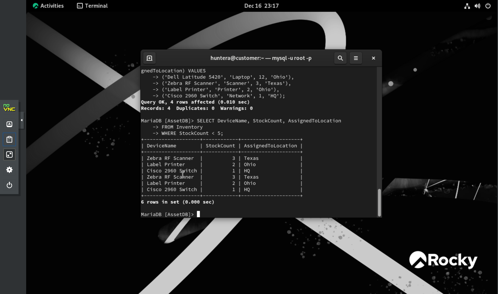

# IT Asset Management Database

A MariaDB database for tracking IT hardware and who it's assigned to across multiple sites, built to replace spreadsheet tracking and answer two questions fast: what's running low, and what's at each location.

## Stack

- MariaDB on Rocky Linux 9, running as a VM on Proxmox VE
- SQL for the schema, sample data, and reports

## Build

### 1. Server and schema
- Provisioned a Rocky Linux 9 VM, installed MariaDB with `dnf`, and secured the root account.
- Designed normalized `Employees` and `Inventory` tables covering laptops, RF scanners, and printers.

### 2. Sample data
- Loaded simulated staff and hardware counts for three sites (HQ, Ohio, Texas) to set a tracking baseline.

### 3. Reports
- **Low stock:** flags any item with `StockCount < 5` so it can be reordered before it runs out.
- **Location audit:** lists all equipment assigned to a given site.

## Files
- [asset_schema.sql](asset_schema.sql): builds the database and inserts the sample data.

## References
- [Video: Installing MariaDB on Linux](https://www.youtube.com/watch?v=XytAiTsts4k)
- [Video: SQL basics](https://www.youtube.com/watch?v=ou5txB0uwP0)
